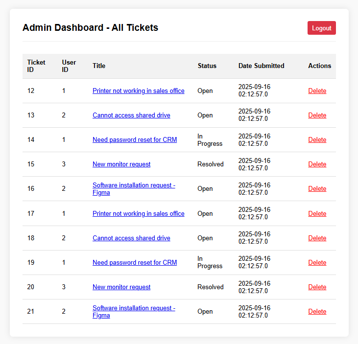
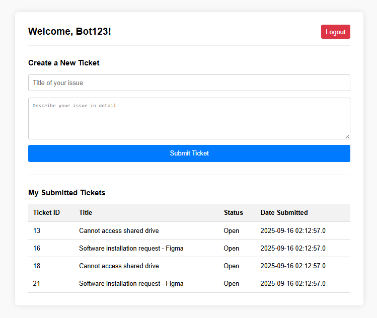
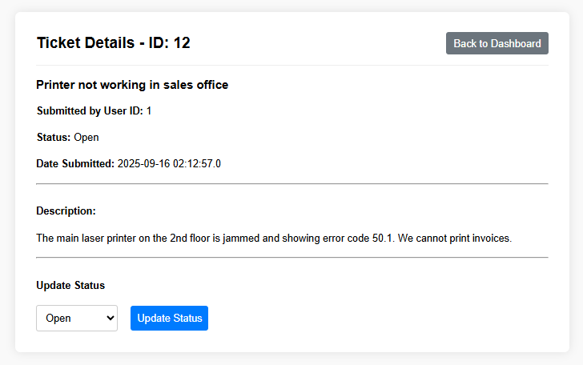
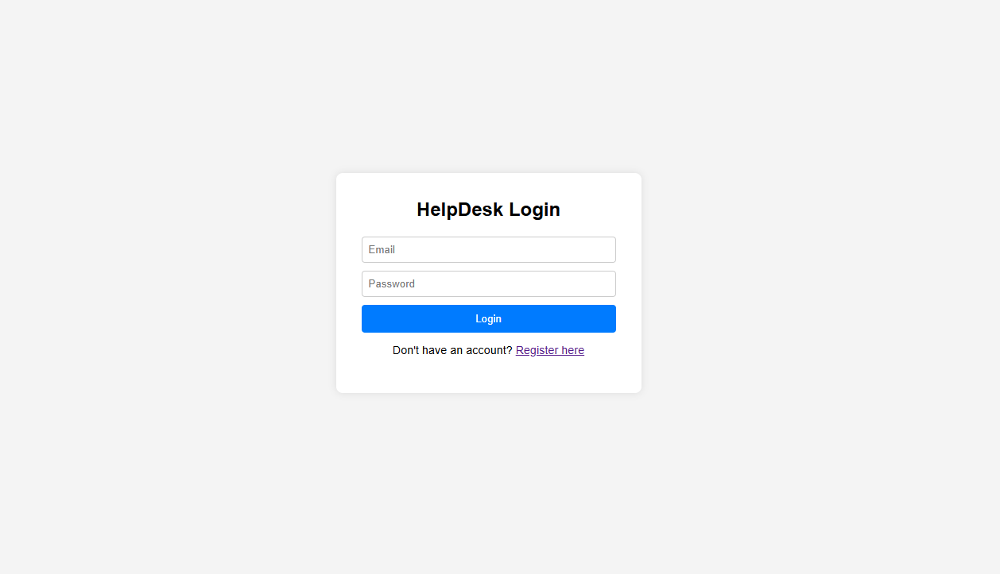

# HelpDesk Management System

[](https://www.java.com)
[](https://jakarta.ee/specifications/servlet/6.0/)
[](https://jakarta.ee/specifications/pages/3.1/)
[](https://www.mysql.com/)
[](https://maven.apache.org/)
[](https://tomcat.apache.org/)

A full-stack web application built from scratch to simulate a real-world IT helpdesk. This project allows users to submit support tickets and enables administrators to manage the entire ticket lifecycle.

This application is built using the **Model-View-Controller (MVC)** design pattern to ensure a clean separation of concerns and maintainable code.

<br>

## Main Application View: Admin Dashboard

<p align="center">
  
</p>

<p align="center">
  This is the central hub for administrators. After an admin logs in, the <code>LoginServlet</code> checks their role and forwards them to the <code>AdminDashboardServlet</code>. This servlet uses the <code>TicketDAO</code> to fetch <i>all</i> tickets from the database and forwards the list to this JSP, which uses JSTL to render the table. From here, an admin can click any ticket to view details, update its status, or delete it.
</p>

---

## Features

This application includes a complete set of features for both users and administrators.

### 👤 User Features

- **Secure Registration & Login**: Users can create an account and log in.
- **Session Management**: User sessions are managed via `HttpSession` to protect routes.
- **Ticket Creation**: Logged-in users are directed to a simple dashboard where they can submit new support tickets via a form.
- **Dynamic Status Tracking**: Users can view a live list of all their submitted tickets and track the status as it's updated by admins.
- **Logout**: Securely invalidates the user's session.

### 👑 Admin Features

- **Admin Authentication**: The system recognizes users with an "admin" role and redirects them to a separate admin dashboard.
- **Global Ticket View**: Admins can view a complete list of all tickets submitted by all users.
- **View Ticket Details**: Admins can click any ticket to be taken to a detailed view page showing the full ticket description.
- **Update Ticket Status**: Admins can update the status of any ticket (Open, In Progress, Resolved, Closed).
- **Delete Ticket**: Admins can delete tickets with a JavaScript confirmation prompt to prevent accidents.

---

## 💻 Tech Stack & Architecture

| Category       | Technology                                                |
| :------------- | :-------------------------------------------------------- |
| **Backend**    | Java, Jakarta Servlets 6.0                                |
| **Frontend**   | JSP 3.1, JSTL (Jakarta Standard Tag Library), HTML5, CSS3 |
| **Database**   | MySQL 8.0                                                 |
| **Server**     | Apache Tomcat 10.1                                        |
| **Build Tool** | Apache Maven                                              |
| **Pattern**    | MVC (Model-View-Controller)                               |

<br>

## 📸 Application Workflow & Screenshots

<table align="center">
  <tr>
    <td align="center"><strong>1. User Dashboard</strong></td>
    <td align="center"><strong>2. Admin Ticket Details</strong></td>
    <td align="center"><strong>3. Login Page</strong></td>
  </tr>
  <tr>
    <td></td>
    <td></td>
    <td></td>
  </tr>
  <tr>
    <td valign="top"><p align="center">The logged-in user experience. The <code>DashboardServlet</code> fetches only this user's tickets from the database and displays their status, alongside the form to create a new ticket.</p></td>
    <td valign="top"><p align="center">When an admin clicks a ticket title, the <code>ViewTicketServlet</code> retrieves the full ticket data. This page displays the details and provides the form (submitting to <code>UpdateStatusServlet</code>) to change the ticket's status.</p></td>
    <td valign="top"><p align="center">The main entry point. This form submits to the <code>LoginServlet</code>, which validates credentials and checks the user's role before forwarding them to the correct user or admin dashboard.</p></td>
  </tr>
</table>

---

## 🚀 Getting Started

To run this project locally:

1.  **Database Setup**:

    - Ensure you have a MySQL server running.
    - Create a new schema named `helpdesk_db`.
    - Run the SQL scripts to create the `users` and `tickets` tables.
    - Update the database credentials in `src/main/java/com/helpdesk/util/DBUtil.java`.

2.  **Build the Project**:

    - This is a Maven project. Run the following command from the project root to build the `.war` file:
      ```bash
      mvn clean package
      ```

3.  **Deploy**:
    - Take the generated `.war` file from the `/target` directory and deploy it to an Apache Tomcat server.
